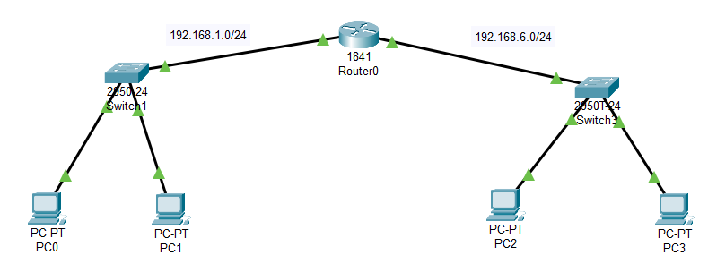
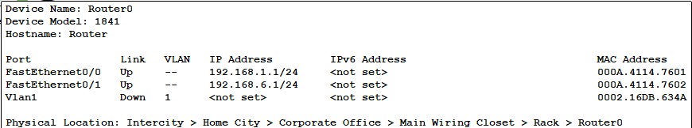
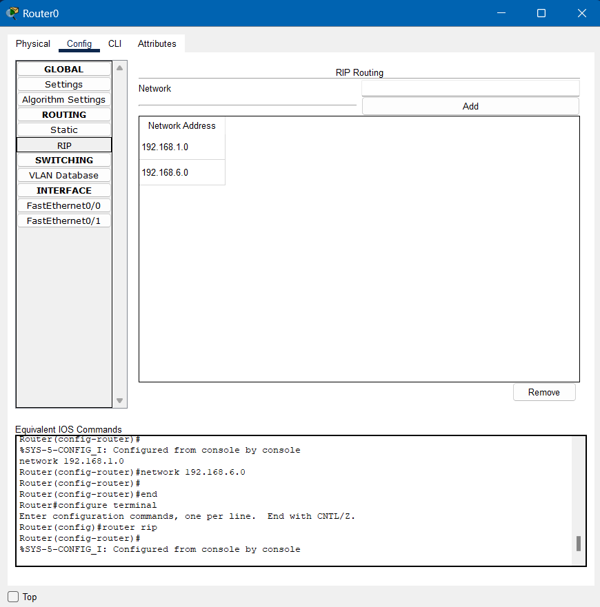

- # _SIMULASI JARINGAN MENGGUNAKAN CISCO PACKET TRACER_

#### Skenario yang digunakan :
1. Ping dari PC 0 (192.168.1.2) ke PC 1 (192.168.1.3) dengan broadcast
2. Ping dari PC 0 (192.168.1.2) ke PC 1 (192.168.1.3)
3. Ping dari PC 0 (192.168.1.2) ke PC 2 (192.168.6.2)
4. Ping dari PC 0 (192.168.1.2) ke PC 1 (192.168.6.3)
5. Ping dari PC 0 (192.168.1.2) ke PC 1 (192.168.1.3) Menggunakan PT-Hub

#### Persiapan:
- ##### Pertama-tama membuat desain rangkaian jaringan dengan 1 Router-PT, 2 Switch, dan 4 PC sehingga menjadi tampilan sebagai berikut :
    
- ##### Konfigurasi router dengan mengubah IP Fast Ethernet menjadi seperti berikut
    
- ##### Kemudian, configure IP address dan default gateway untuk masing-masing PC
     
     
     
     

- ##### Tambahkan RIP routing supaya bisa melakukan <i>ping</i> dengan PC yang berbeda switch
    

#### Percobaan:

##### 1. Ping dari PC 0 ke PC 1 (broadcast)
Membuka command prompt pada <strong>PC 0</strong>, dan melakukan ping ke address <strong>PC 1</strong> 
  
##### Pada pengiriman pertama, <strong>PC 0</strong> dengan address <strong>192.168.1.3</strong>  dan PC 1 melakukan broadcast, dimana <strong>PC 0</strong> menghubungkan ke <strong>PC 1</strong> dengan mencari IP addressnya. Setelah mendapatkan IP address dari <strong>PC 1</strong>, <strong>PC 0</strong> sebagai pengirim, mengirimkan packet sebanyak 4 kali ke penerima, yaitu <strong>PC 1</strong>. 
 

##### 2. Ping dari PC 0 ke PC 1
Membuka command prompt pada <strong>PC 0</strong>, dan melakukan ping ke address <strong>PC 1</strong>  
 
##### Pada pengiriman kedua ini, PC 0 dengan address <strong>192.168.1.3</strong>  dan PC 1 dengan address <strong>192.168.1.2</strong>  tidak melakukan broadcast, karena IP address dari <strong>PC 1</strong> sudah dikenali, sehingga waktu untuk pengiriman packet pertama lebih cepat. 
 

##### 3. Ping dari PC 0 ke PC 2
Membuka command prompt pada <strong>PC 0</strong>, dan melakukan ping ke address <strong>PC 2</strong>  
 
##### Pada pengiriman kali ini, PC 0 dengan address <strong>192.168.1.3</strong> mengirim packet menuju PC 2 dengan address <strong>192.168.6.2</strong>  yang mana berada dalam switch yang berbeda. Sama seperti percobaan sebelumnya, pengiriman packet pertama lebih lama dibandingkan yang sesudahnya karena ia melakukan broadcast terlebih dahulu, untuk mengenali IP address dari PC 2 

##### 4. Ping dari PC 0 ke PC 3
Membuka command prompt pada <strong>PC 0</strong>, dan melakukan ping ke address <strong>PC 3</strong> 
 
##### Pada pengiriman kali ini, <strong>PC 0</strong> dengan address <strong>192.168.1.3</strong> mengirim packet menuju <strong>PC 3</strong> dengan address <strong>192.168.6.3</strong>  yang mana berada dalam switch yang berbeda. Terlihat bahwa pengiriman pertama mengalami RTO yang disebabkan oleh ARP caching, ketika mencoba untuk berkomunikasi dengan host yang baru, sehingga memicu proses ARP untuk mencari address tujuan. Namun, pada proses berikutnya reply yang didapatkan dengan cepat.  

##### 5. Ping dari PC 0 ke PC 1 (PT Hub)
Percobaan selanjutnya ialah mengganti Switch dengan PT-Hub dengan rangkaian sebagai berikut : 
 
##### Pada pengiriman ini PC 0 dengan address <strong>192.168.1.2</strong> mengirimkan packet menuju PC 1 dengan address <strong>192.168.1.3</strong>. 
 
#### Dari hasil diatas, dapat disimpulkan bahwa penggunaan PT-Hub adalah hub yang akan melakukan broadcast ke semua perangkat yang terhubung setiap kali packet dikirim, bahkan jika hanya satu perangkat tujuan, sehingga membuat lalu-lintas yang terjadi tidak efisien
