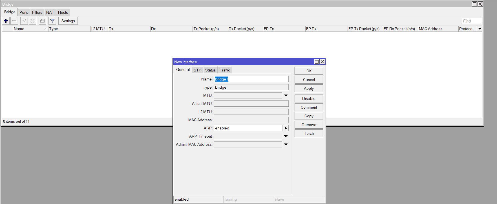
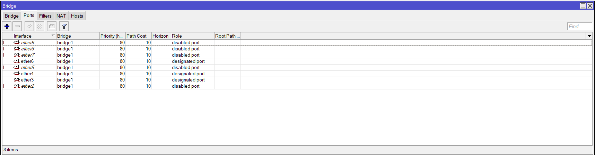

**<h1 style="font-family:bahnschrift;">~ PENDAHULUAN</h1>**

***<h2 style="font-family:bahnschrift;">1. Mikrotik</h2>***

***<h4 style="font-family:bahnschrift;">1.1.Pengertian Mikrotik</h4>***
> 
 Mirkrotik ialah sistem operasi yang berbasis perangkat lunak (software) yang dipergunakan untuk menjadikan komputer sebagai router sebuah jaringan. Mikrotik juga menggunakan sistem operasi berbasis Linux dan menjadi dasar network router. Sistem operasi (OS) ini sangat cocok untuk membangun administrasi jaringan komputer yang berskala kecil hingga besar.
> 
***<h4 style="font-family:bahnschrift;">1.2.Fungsi Mikrotik</h4>*** 

- 
 Memberikan sistem otentikasi
- 
 Konfigurasi jaringan lokal
- 
 Mengelola sistem jaringan internet
- 
 Memberikan peran sebagai hotspot
- 
 Membuat PPPoE Server

***<h4 style="font-family:bahnschrift;">1.3. Jenis Mikrotik</h4>*** 

- 
 Mikrotik RouterOS  
  
    > Sistem operasi yang dipakai berbasis UNIX yang menyediakan fitur mulai dari paket router, bridge, firewall, proxy server, hotspot dan lain sebagainya. Dengan Mikrotik ini memungkinkan untuk membangun router sendiri hanya dengan menggunakan sebuah OS. 
    
- 
 RouterBoard
    
  >RouterBoard berukuran sangat kecil dan lebih praktis, yang dapat melakukan proses instalasi RouterOS pada RouterBoard yang telah terkonfigurasi dengan baik. RouterBoard terdiri dari sebuah processor, ROM, RAM, dan flash memory.

***<h4 style="font-family:bahnschrift;">1.4. Manfaat Mikrotik</h4>*** 

- 
 Sebagai <i>Internet Gateway</i> pada jaringan lokal
- 
 Sebagai penghubung antar jaringan, atau routing
- 
 Sebagai <i>Access point</i>

**<h1 style="font-family:bahnschrift;">~ PERCOBAAN</h1>**
- ### _1. WinBox_

#### 1. Mengisi Address pada Address List
  
- #### - Isi address untuk router sesuai nomor kelompok
  
##### Kelompok 7 maka address kita isi dengan 10.252.108.17/24, network (10.252.108.0), dan interface ether1.
- #### - Isi IP address untuk tiap PC kelompok 7
  
##### Address kita isi dengan 192.168.7.1/24, network (192.168.7.0), dan interface bridge1.
- #### - Tampilan setelah terisi
  

#### 2. Mengisi Route pada Route List
  
- #### - Tambahkan Route baru 
  
##### Dst. Address kita isi dengan 192.168.1.0 dengan Gateway 10.252.108.11.
- #### - Tambahkan route untuk semua kelompok (1-10)
  
##### Lakukan cara yang sama untuk menambahkan route baru setiap kelompok.

#### 3. Menambahkan Bridge & Ports
  
- #### - Tambahkan interface
  
##### Isi Name dengan bridge1.
- #### - Tambahkan Ports (untuk tiap kelompok)
  
  

#### 4. Menambahkan DHCP Server
  
  
  
  
  
  
  

#### 5. Melakukan PING antar kelompok
- #### - Percobaan terhadap kelompok 1
  
##### Isi Name dengan bridge1.
- #### - Percobaan terhadap kelompok 2
  

#### Proses ping dengan kelompok 1 dan 2 berhasil, hal yang sama dapat kita lakukan dengan kelompok lain (kelompok 3-10).
#
- ### _2. Topologi dalam Cisco Packet Tracer_
  

#### 1. Konfigurasi PC
- #### - Mengatur Default Gateway pada tiap PC sesuai kelompok
#### Kelompok 7
  
#### Kelompok 8
  
- #### - Mengisi IP address pada tiap PC sesuai kelompok
#### Kelompok 7
  
  
  
#### Kelompok 8
  
  
  

#### 2. Konfigurasi sub-Router
- #### - Mengatur IP dan Subnet pada FastEthernet yang terhubung ke tiap PC (3 pc)
#### Kelompok 7
  
#### Kelompok 8
  
- #### - Mengatur IP dan Subnet pada FastEthernet yang terhubung ke Router Utama
#### Kelompok 7
  
  
#### Kelompok 8
  
  

### Demikian Laporan Percobaan dari kelompok 7, dengan menggunakan winbox dan juga Cisco Packet Tracer
