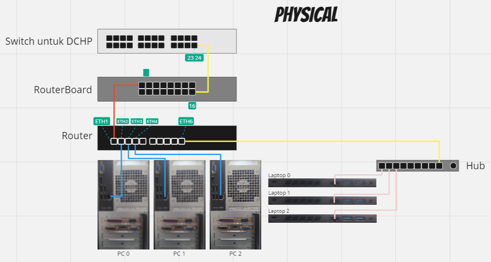

    Nama		        : Raihan Eka Pramudya
    NRP		        : 3122600011
    Kelas		        : 2 D4 Teknik Informatika A
    Mata Kuliah	        : Konsep Jaringan
    Dosen Pengampu	        : Dr. Ferry Astika Saputra S.T., M.Sc

_**<h1 style="font-family:bahnschrift;">Ping antar PC</h1>**_
>
 PC Kelompok 1
 
>
 PC Kelompok 2
 
>
 PC Kelompok 3
 
>
 PC Kelompok 4
 
>
 PC Kelompok 5
 
>
 PC Kelompok 6
 
>
 PC Kelompok 8
 
>
 PC Kelompok 9
 
>
 PC Kelompok 10
 
#
_**<h1 style="font-family:bahnschrift;">Gambar Physical & Logical</h1>**_
 
 
#
_**<h1 style="font-family:bahnschrift;">Routing Table</h1>**_
 
#
