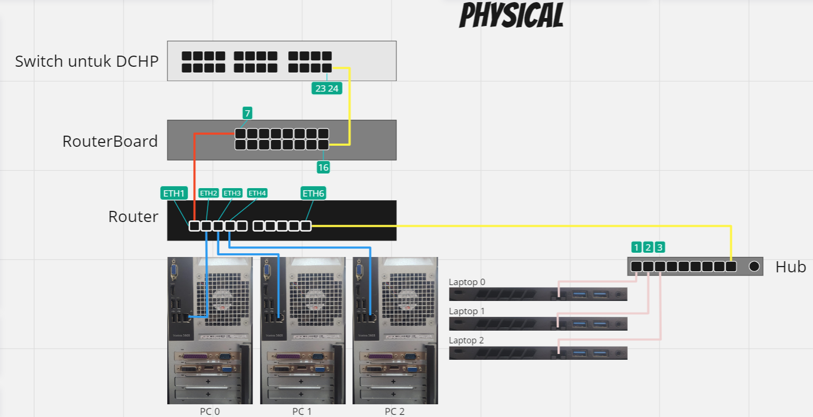
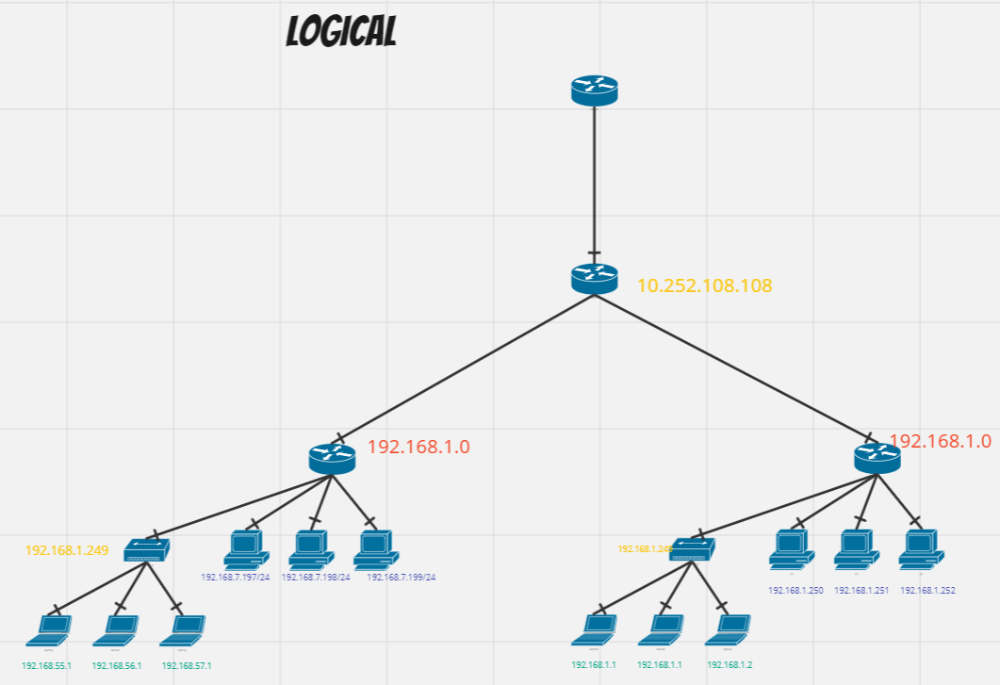

    Nama		        : Raihan Eka Pramudya
    NRP		        : 3122600011
    Kelas		        : 2 D4 Teknik Informatika A
    Mata Kuliah	        : Konsep Jaringan
    Dosen Pengampu	        : Dr. Ferry Astika Saputra S.T., M.Sc

_**<h1 style="font-family:bahnschrift;">Ping antar PC</h1>**_
>
 PC Kelompok 1
 
>
 PC Kelompok 2
 
>
 PC Kelompok 3
 
>
 PC Kelompok 4
 
>
 PC Kelompok 5
 
>
 PC Kelompok 6
 
>
 PC Kelompok 8
 
>
 PC Kelompok 9
 
>
 PC Kelompok 10
 
#

_**<h1 style="font-family:bahnschrift;">Gambar Physical & Logical</h1>**_

<h3 style="font-family:bahnschrift;">Keterangan</h3>
- 
<strong>Switch untuk DCHP </strong> menggunakan tipe MikroTik Smart Cloud Switch CSS326-24G-2S+RM
- 
<strong>RouterBoard</strong> menggunakan Tp-Link TL-SG1016D
- 
<strong>Router</strong> menggunakan MikroTik RouterBoard  RB 3011 Ui AS-RM
- 
<strong>kabel kuning dari 23 24 ke 16</strong> Menggunakan kabel UTP CAT6
- 
<strong>kabel 7 ke ETH1 </strong> Menggunakan kabel UTP CAT6
- 
<strong>kabel ETH2 ke PC0 </strong> Menggunakan kabel UTP CAT6
- 
<strong>kabel ETH3 ke PC1 </strong> Menggunakan kabel UTP CAT6
- 
<strong>kabel ETH4 ke PC2 </strong> Menggunakan kabel UTP CAT6
- 
<strong>kabel ETH6 ke Hub </strong> Menggunakan kabel UTP CAT6
- 
<strong>kabel Hub 1 ke Laptop 0 </strong> Menggunakan kabel UTP CAT5E
- 
<strong>kabel Hub 2 ke Laptop 1 </strong> Menggunakan kabel UTP CAT5E
- 
<strong>kabel Hub 3 ke Laptop 2 </strong> Menggunakan kabel UTP CAT5E 

  

_**<h1 style="font-family:bahnschrift;">Routing Table</h1>**_
 
#
