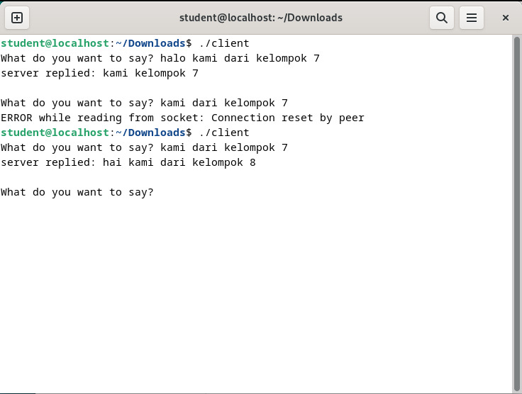
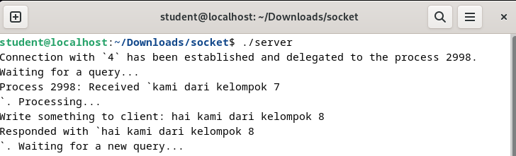

    Nama		        : Raihan Eka Pramudya
    NRP		        : 3122600011
    Kelas		        : 2 D4 Teknik Informatika A
    Mata Kuliah	        : Konsep Jaringan
    Dosen Pengampu	        : Dr. Ferry Astika Saputra S.T., M.Sc
    
# Aplikasi Chat ke Lintas Kelompok

><div class ="isi" style="font-family:bahnschrift;"> Dengan menggunakan program dari pertemuan sebelumnya, yakni server.c dan client.c kami kelompok 7 melakukan chat dengan kelompok 8, dengan mengubah client.c menjadi berikut
 <br>

```server = gethostbyname("192.168.8.198");``` <br> <br>
><div class ="isi" style="font-family:bahnschrift;"> Dari sisi client (Kelompok 7)
<br><br>

><div class ="isi" style="font-family:bahnschrift;"> Dari sisi server (Kelompok 8)
<br>
    
