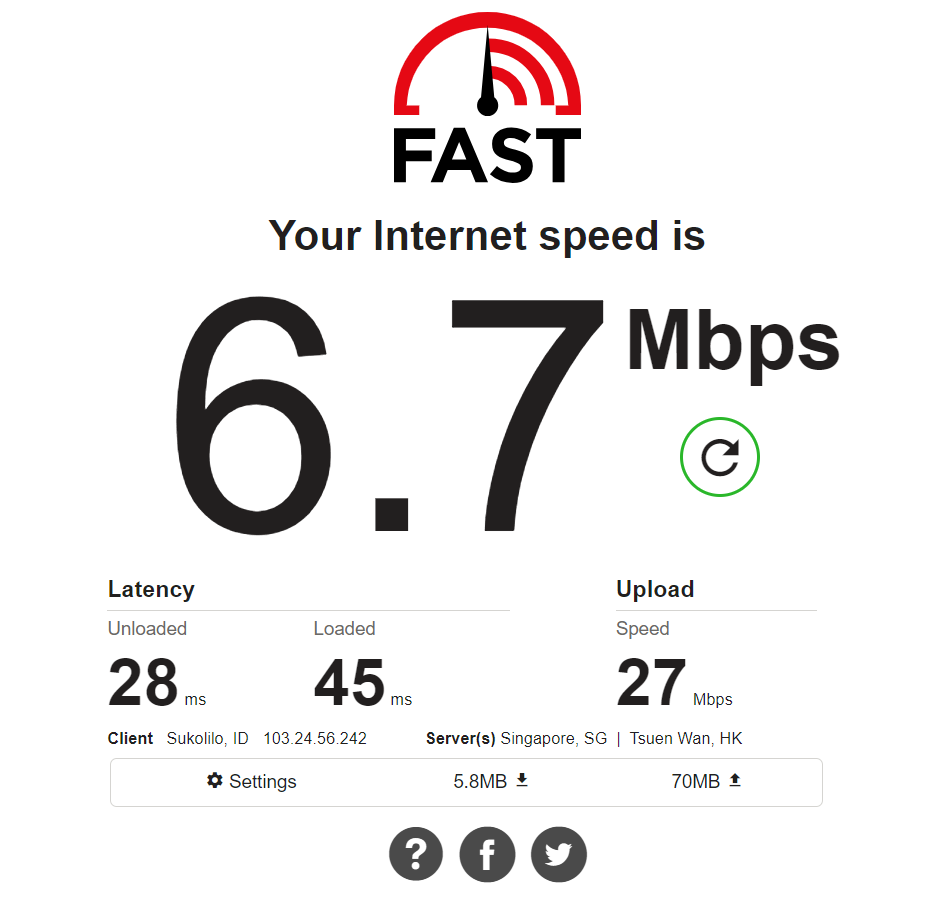
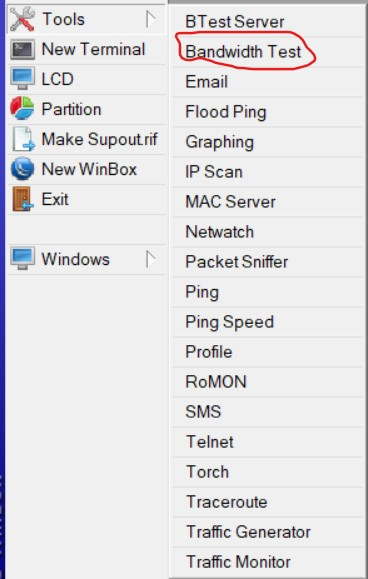
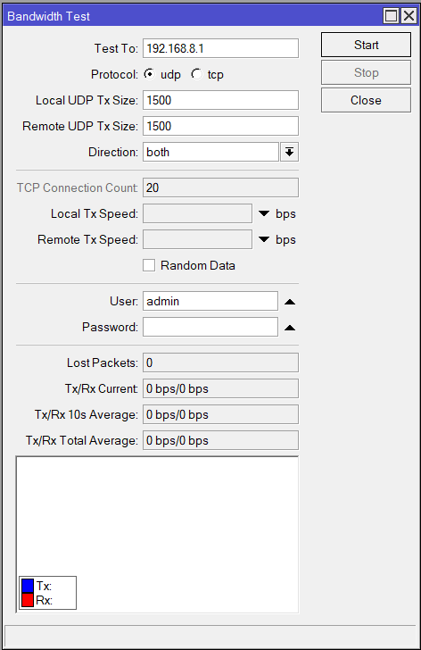
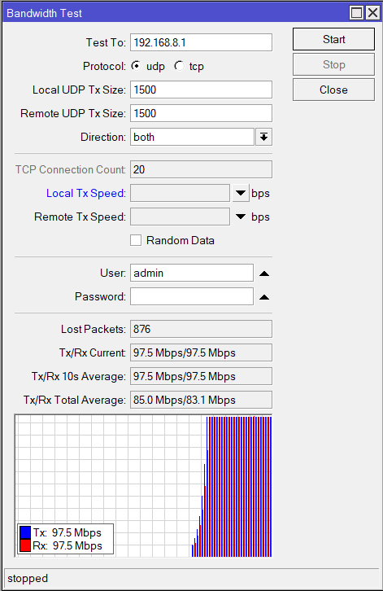

    Nama		        : Raihan Eka Pramudya
    NRP		        : 3122600011
    Kelas		        : 2 D4 Teknik Informatika A
    Mata Kuliah	        : Konsep Jaringan
    Dosen Pengampu	        : Dr. Ferry Astika Saputra S.T., M.Sc
    
# Bandwith Test Server
### Pengertian
#### Bandwidth adalah istilah yang digunakan untuk mengukur seberapa besar volume data yang dapat ditransfer melalui suatu saluran komunikasi dalam suatu periode waktu tertentu. Bandwidth diukur dalam bit per detik (bps), kilobit per detik (kbps), megabit per detik (Mbps), atau gigabit per detik (Gbps), tergantung pada seberapa besar kapasitas transfer data yang dibutuhkan. 
#
### Melakukan pengetesan Bandwith menggunakan fast.com
>
Dengan menggunakan Ethernet yang disambungkan ke PC mahasiswa, didapatkan kecepatan sebagai berikut :  
 
#
### Melakukan pengetesan menggunakan winbox

>
 Melakukan bandwith test dengan klik tools > Bandwith Test
  

>
Kemudian akan muncul tampilan berikut, isi Test To dengan gateway dari kelompok 8 dan klik "Start untuk memulai pengecekan
  

>
Setelah selesai, akan muncul data seperti berikut
  
