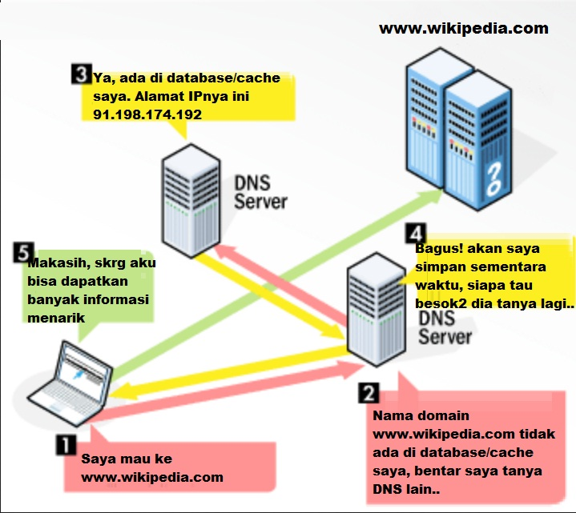
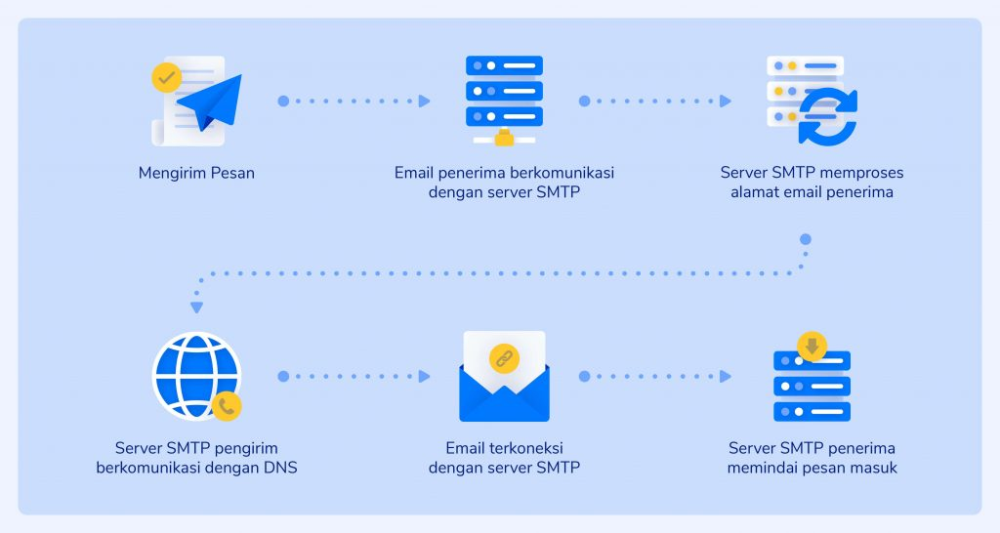

    Nama		        : Raihan Eka Pramudya
    NRP		        : 3122600011
    Kelas		        : 2 D4 Teknik Informatika A
    Mata Kuliah	        : Konsep Jaringan
    Dosen Pengampu	        : Dr. Ferry Astika Saputra S.T., M.Sc
    
# -DNS SERVER

>
 DNS atau Domain Name System adalah sistem yang digunakan untuk menerjemahkan nama domain yang simpel diingat menjadi alamat IP numerik yang unik untuk mengidentifikasi alamat tujuan di internet (resolusi nama domain).   Jika diibaratkan seperti buku telepon internet. Bayangkan jika internet adalah kota besar dan setiap situs web atau alamat IP adalah nomor telepon. Namun, akan sulit jika menghafal nomor-nomor telepon tersebut, maka kita menggunakan buku telepon, dan DNS server berfungsi sebagai buku telepon ini di dunia internet.
  

## CARA KERJA
  

1. *Permintaan:*
   - Client memasukkan nama domain (misalnya, www.wikipedia.com) ke dalam peramban web, komputer akan mengirim permintaan ke server DNS.

2. *Lokal DNS Server:*
   - Server DNS lokal pertama kali memeriksa cache lokalnya untuk melihat apakah alamat IP untuk nama domain tersebut sudah disimpan. Jika iya, maka alamat IP tersebut dikembalikan tanpa harus melakukan pencarian lebih lanjut.

3. *Recursive DNS Server:*
   - Jika alamat IP tidak ada dalam cache lokal, server DNS lokal akan melakukan pencarian rekursif. Server tersebut akan bertanya ke server DNS lainnya hingga menemukan alamat IP yang sesuai. Setelah ditemukan, alamat IP tersebut akan disimpan dalam cache lokal untuk penggunaan selanjutnya.

4. *Authority DNS Server:*
   - Server DNS otoritatif adalah server yang menyimpan catatan DNS asli untuk domain tersebut. Jika server rekursif tidak memiliki informasi dalam cache, ia akan menghubungi server DNS otoritatif untuk mendapatkan alamat IP yang benar.

5. *Resolusi Nama Domain:*
   - Setelah alamat IP ditemukan, server DNS lokal mengirimkannya kembali ke komputer client, dan browser kemudian menggunakan alamat IP tersebut untuk membuat koneksi ke server web yang diinginkan pengguna.
     

# -EMAIL SERVER

>
 Email server adalah server komputer yang bertanggung jawab untuk mengelola pengiriman, penerimaan, dan penyimpanan email. Ada dua jenis server email utama: server pengiriman (SMTP) dan server penerima (POP3 atau IMAP).   Jika diibaratkan email server seperti kantor pos untuk internet, jika ingin mengirim surat kepada teman atau keluarga, maka kita akan membawanya ke kantor pos lokal lalu surat akan dikirimkan ke penerima. Email server berfungsi serupa di dunia internet.
  

## CARA KERJA
  

1. *Mengirim Email (SMTP):*
   - Ketika mengirim email, client email akan menghubungi server SMTP untuk mengirim pesan. Server SMTP ini mengambil pesan dan mengirimkannya ke server penerima.
     
2. *Menerima Email (POP3/IMAP):*
   - Saat ingin membaca email, client email akan terhubung ke server penerima menggunakan protokol POP3 atau IMAP. POP3 mengunduh email ke perangkat lokal, sementara IMAP bertugas untuk menyinkronkan email antara server dan perangkat lokal.
     
3. *Menyimpan Email:*
   - Email server menyimpan email di kotak surat pengguna. Ini termasuk pesan yang dikirim dan diterima serta lampiran yang terkait.

4. *Send & Recieve:*
   - Server SMTP dan server penerima bekerja bersama untuk menyampaikan pesan dari pengirim ke penerima. Mereka menggunakan protokol khusus untuk berkomunikasi dan memastikan bahwa email sampai pada tujuan dengan aman.

5. *Autentikasi Keamanan:*
   - Hingga saat ini penggunaan email semakin aman, server email mengimplementasikan berbagai mekanisme autentikasi dan keamanan, seperti SSL/TLS, untuk melindungi komunikasi email dari akses yang tidak sah atau peretasan.
    
