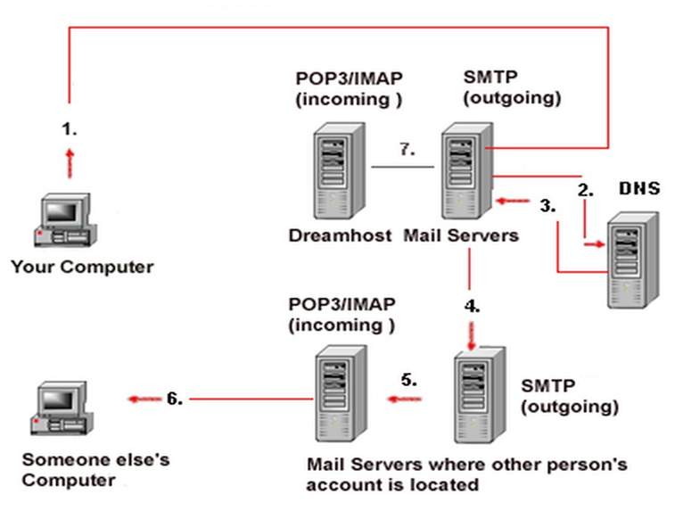

    Nama		        : Raihan Eka Pramudya
    NRP		        : 3122600011
    Kelas		        : 2 D4 Teknik Informatika A
    Mata Kuliah	        : Konsep Jaringan
    Dosen Pengampu	        : Dr. Ferry Astika Saputra S.T., M.Sc
    
# DNS SERVER

><div class ="isi" style="font-family:bahnschrift;"> DNS atau Domain Name System adalah sistem yang digunakan untuk menerjemahkan nama domain yang simpel diingat menjadi alamat IP numerik yang unik untuk mengidentifikasi alamat tujuan di internet (resolusi nama domain). <br> Jika diibaratkan seperti buku telepon internet. Bayangkan jika internet adalah kota besar dan setiap situs web atau alamat IP adalah nomor telepon. Namun, akan sulit jika menghafal nomor-nomor telepon tersebut, maka kita menggunakan buku telepon, dan DNS server berfungsi sebagai buku telepon ini di dunia internet.
 <br>

## CARA KERJA
```server = gethostbyname("192.168.8.198");``` <br> <br>
<br><br>

# EMAIL SERVER

><div class ="isi" style="font-family:bahnschrift;"> Email server adalah server komputer yang bertanggung jawab untuk mengelola pengiriman, penerimaan, dan penyimpanan email. Ada dua jenis server email utama: server pengiriman (SMTP) dan server penerima (POP3 atau IMAP). <br> Jika diibaratkan email server seperti kantor pos untuk internet, jika ingin mengirim surat kepada teman atau keluarga, maka kita akan membawanya ke kantor pos lokal lalu surat akan dikirimkan ke penerima. Email server berfungsi serupa di dunia internet.
 <br>

```server = gethostbyname("192.168.8.198");``` <br> <br>
><div class ="isi" style="font-family:bahnschrift;"> Dari sisi server (Kelompok 8)
<br>
    
